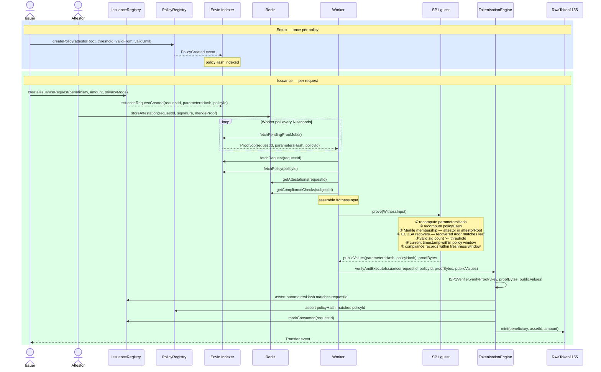

# Eudemonia · SP1 RWA Tokenisation

> Compliance-bound institutional issuance on ADI Chain. Off-chain approval decisions enforced on-chain, no trusted intermediary required.

## Context

RWA tokenisation is early. Institutions are experimenting but adoption is slow, and for real reasons.

**Trust is still the core problem.** The cloud took a decade to move from institutional scepticism to standard infrastructure. Blockchain is somewhere in that curve. Institutions will play with the technology but they need compliance tooling that maps to their regulatory obligations and existing workflows — not generic infrastructure that requires them to change how they operate. The ask isn't "use blockchain", it's "here's how this fits your existing approval process and compliance requirements."

**Privacy is a requirement, not a feature.** Institutional workflows leak sensitive information: counterparty addresses, positions, trade sizes, approval quorums. Institutions won't put those on a transparent chain. Configurable, compliant privacy — where each party sees only what they need to see — is a precondition for adoption. Until that's solved properly, the institutions that need privacy most will move slowest. This isn't a product differentiator; it's table stakes.

**Tokenisation is useful when it increases utility.** Access, settlement speed, programmability — these justify the complexity. A digital representation of an asset that still settles the same way, with the same counterparties, through the same process, doesn't. This project focuses specifically on the compliance and trust layer.

## The problem

How do you mint tokens only when off-chain compliance decisions have actually been made, without a trusted intermediary certifying them?

The decisions in question: a quorum of authorised compliance officers approved this issuance; the beneficiary passed KYC/AML within the last N days; the parameters have not changed since approval. These involve private data, multi-party coordination, and off-chain processes.

Three approaches fall short:

**Trusted oracle** — one operator certifies compliance and submits the transaction. No on-chain way to verify the certification corresponds to an actual quorum decision over the actual parameters.

**On-chain multisig** — attestors sign on-chain transactions. Leaks compliance data publicly, costs O(n) ECDSA verifications, doesn't bind the signed data to execution parameters without putting everything on-chain.

**Off-chain multisig relayed by oracle** — attestors sign off-chain; an oracle relays signatures; the contract verifies them. Still O(n) on-chain verification, growing with quorum size, and the oracle is still trusted.

What's needed: a single constant-size proof that certifies k-of-n authorised attestors signed these exact parameters, those attestors are registered, compliance records are fresh, and the policy window holds. Fixed verification cost regardless of quorum size.

## What this is

An end-to-end institutional issuance pipeline on **ADI Chain** using **SP1** (Succinct's zkVM).

`TokenisationEngine.verifyAndExecuteIssuance()` mints if and only if a valid SP1 proof certifies `(parametersHash, policyHash)`, and those values match on-chain state.

```
parametersHash = keccak256(requestId, beneficiary, amount, privacyMode, chainId, issuanceRegistryAddress)
policyHash     = keccak256(policyId, attestorMerkleRoot, threshold, validFrom, validUntil, privacyConstraints)
```

To mint with forged parameters: break SNARK soundness. To replay a past proof: the request is marked `CONSUMED` on first execution and reverts on the second call.

## Architecture



## Components

| Layer | Crate / package | What it does |
|-------|-----------------|--------------|
| ZK program | `crates/programs/issuance-claim` | SP1 guest. Receives witness, runs all checks, outputs public values |
| ZK SDK | `crates/sdk` | Shared Rust library: Merkle verification, ECDSA recovery, hash computation, ABI encoding |
| Prover CLI | `crates/prover` | Assembles witness JSON, validates it, writes public values, calls external SP1 prover |
| Contracts | `contracts/` | IssuanceRegistry, PolicyRegistry, PaymentRegistry, TokenisationEngine, RwaToken1155, ConfidentialSettlement |
| Indexer + worker | `indexer/src/` | Envio HyperIndex event handlers; Redis-backed async proof worker; GraphQL serving |
| Dashboard | `ui/` | Vue 3 multi-role interface (admin, issuer, attestor, worker) |

## Cryptographic design

### The witness

The SP1 guest receives a `WitnessInput` struct ([`crates/sdk/src/types.rs`](crates/sdk/src/types.rs)):

```rust
/// Canonical witness payload used by prover/guest validation logic.
pub struct WitnessInput {
    /// Issuance request identifier.
    pub request_identifier: String,
    /// Policy identifier.
    pub policy_identifier: String,
    /// Chain id bound into parameters hash domain separation.
    pub chain_id: String,
    /// IssuanceRegistry contract address bound into parameters hash domain separation.
    pub issuance_registry: String,
    /// Request field set used to recompute `parametersHash`.
    pub request: RequestWitness,
    /// Policy field set used to recompute `policyHash` and enforce policy rules.
    pub policy: PolicyWitness,
    /// Attestation records used for signature + membership threshold verification.
    pub attestations: Vec<AttestationWitness>,
    /// Compliance checks used for required-check and freshness validation.
    pub checks: Vec<ComplianceCheckRecord>,
    /// Current timestamp (seconds since epoch) used for validity/freshness checks.
    pub current_timestamp: u64,
}
```

### What the guest proves

Seven checks. If any fails, no valid proof can be produced and nothing gets minted.

**1. Hash recomputation.** Recomputes `parametersHash` from request fields and `policyHash` from policy fields. These are the public values. Any field change shifts the hash, which mismatches the on-chain commitment.

**2. Merkle membership.** For each attestation, verifies the attestor's address is a leaf in the Merkle tree whose root is committed in `policyHash`. Addresses outside the registered set cannot contribute to threshold regardless of whether they produce a valid signature.

**3. ECDSA signature recovery.** Recovers the signing address from the signature over `keccak256(parametersHash ++ policyHash)`. Recovered address must match the Merkle leaf. This confirms: the signer is authorised, and they signed these specific parameters.

**4. Threshold.** Count of attestations passing (2) and (3) must be ≥ the threshold committed in `policyHash`.

**5. Policy validity window.** `current_timestamp` must fall within `[validFrom, validUntil]` committed in `policyHash`.

**6. Compliance check freshness.** Each compliance record must have been issued within the staleness window committed in the policy. Outdated KYC data fails.

**7. Domain separation.** `chainId` and `issuanceRegistryAddress` are embedded in the hash inputs. A proof from one chain or registry cannot be replayed on another.

Output is exactly two 32-byte values: `(parametersHash, policyHash)`. The `TokenisationEngine` reads the same values from its registries and checks equality. They match only if the witness fields are byte-for-byte consistent with what was stored when the request was created.

### Verification cost

SP1 is a zkVM: it proves that a Rust binary executed correctly on a given input and produced a specific output. The on-chain verifier checks a constant-size proof against the verification key and public values — it does not re-execute the computation. Verification cost on ADI Chain is fixed regardless of quorum size, number of compliance checks, or witness complexity.

The verification key (`artifacts/sp1/issuance-claim.vkey.txt`) is derived from the compiled guest binary. If the guest binary changes, the verification key changes and proofs from the old binary stop verifying. `TokenisationEngine` stores the expected key and rejects anything else.

## Security model

**Trusted:**
- ADI chain BFT consensus and finality
- The deployed `ISP1Verifier` contract correctly verifies SP1 proofs
- The ELF binary in `artifacts/sp1/issuance-claim` matches the source in `crates/programs/issuance-claim/src/`

**Not trusted (handled by the circuit):**

| Threat | Mitigation |
|--------|------------|
| Worker submits proof for wrong parameters | `parametersHash` recomputed inside guest; on-chain equality check fails if any field was altered |
| Replay of a past valid proof | `requestId` committed inside `parametersHash`; request marked `CONSUMED` on first execution; second call reverts |
| Forged attestations or insufficient quorum | ECDSA recovery + Merkle membership verified inside circuit; threshold enforced; too few valid sigs → proof generation fails |
| Expired policy | Validity window checked against committed timestamps inside circuit |
| Stale KYC/AML data | Compliance record freshness enforced inside circuit |
| Admin creates fraudulent policy | Admin is a multisig (`MultisigOwnable`); policy changes versioned with auditable on-chain events; `policyHash` binds the full configuration |

**Out of scope (MVP):**
- Real-world asset backing — requires external oracles or data availability not addressed here
- Witness privacy — SP1 proofs are publicly verifiable; the witness is held by the worker
- Privacy modes beyond the four implemented: transparent, destination-private, amount-private, full-private

## Getting started

### One command

```bash
make start-everything
```

Spins up dual Anvil forks, deploys all contracts, assigns demo participants, syncs addresses into env files, and starts the full docker compose stack (Postgres, Redis, Hasura, indexer, worker, UI).

```bash
make stop-everything    # tear it all down
```

### Prerequisites

- Rust 1.92.0 (the `rust-toolchain` file pins this; install via [rustup](https://rustup.rs/))
- [Foundry](https://getfoundry.sh/) (`forge`, `cast`, `anvil`)
- Node.js ≥ 18
- Docker + Docker Compose
- [Succinct CLI](https://docs.succinct.xyz/) for real proofs; set `SP1_MOCK_MODE=true` to skip during development

### Configuration

Each sub-project reads its own `.env`:

```bash
cp contracts/.env.example contracts/.env   # RPC_URL, PRIVATE_KEY, SP1_VERIFIER_ADDRESS
cp indexer/.env.example  indexer/.env      # registry addresses, REDIS_URL, SP1_* vars
cp ui/.env.example       ui/.env           # RPC URL, contract addresses
```

The Makefile pre-populates deterministic test accounts for local development.

### Step by step

```bash
# Start local Anvil forks
make anvil-adi-up

# Deploy all contracts to the local fork
make deploy-all-contracts

# Sync deployment addresses into indexer/.env and ui/.env
make sync-local-addresses

# Start backing infrastructure (Postgres, Redis, Hasura GraphQL) + indexer + worker + UI
make start-components
```

Or run each service separately in its own terminal:

```bash
cd indexer && npm install && npm run dev       # Envio indexer
cd indexer && npm run worker:dev               # proof worker
cd ui && npm install && npm run dev            # dashboard
```

### Demo flow

Seven-step demo using Anvil test accounts (7 employees, 2 auditors). `SP1_MOCK_MODE=true` skips real proving.

```bash
make demo-setup     # register participants, create issuance policy
make demo-request   # issuer submits an issuance request
make demo-attest    # attestors sign approval (k-of-n quorum)
make demo-status    # poll until worker produces proof and submits execution
make demo-audit     # inspect IssuanceAuditReceipt event

# or all at once
make demo-flow
```

### Tests

```bash
make contracts-test          # Solidity: unit, integration, fuzz, invariant
make rust-test               # Rust: SDK validation + prover CLI integration
cd indexer && npm test       # TypeScript: worker retry logic
```
