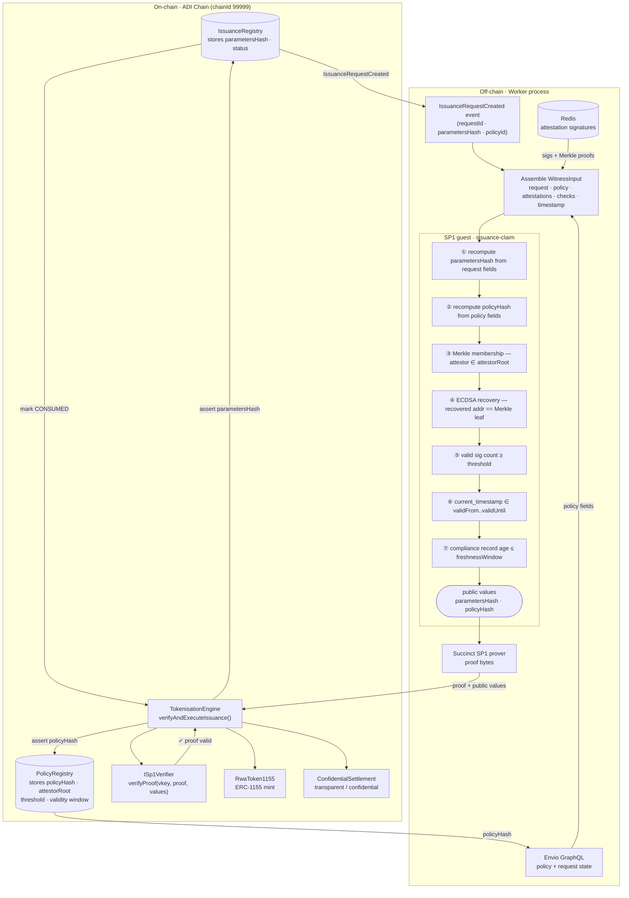

# Eudemonia · SP1 RWA Tokenisation

> Trustless institutional issuance: cryptographically bind off-chain compliance decisions to on-chain execution using succinct zero-knowledge proofs.

## The problem

Institutional tokenisation of real-world assets requires answering a question that has no clean solution in current blockchain infrastructure: how do you mint tokens only when a set of off-chain conditions have been met, without introducing a trusted intermediary to certify those conditions?

The conditions in question are things like: a quorum of authorised compliance officers has approved this specific issuance request; the beneficiary has passed KYC/AML checks within the last N days; the issuance parameters (amount, beneficiary address, privacy mode) have not been altered since approval. These conditions involve private data, multi-party coordination, and cryptographic attestations — none of which fit naturally into an on-chain smart contract.

The approaches that seem obvious fail in predictable ways:

**Trusted oracle.** A single operator certifies off-chain compliance and submits a transaction. This works until the operator is compromised or acts maliciously. There is no on-chain way to verify that the operator's certification corresponds to an actual quorum decision over the actual parameters.

**On-chain multisig.** Attestors sign on-chain transactions. This leaks compliance data publicly, incurs O(n) verification cost for n attestors, and still provides no binding between the signed data and the execution parameters unless you put everything on-chain.

**Off-chain multisig relayed by oracle.** Attestors sign a commitment to the parameters off-chain; an oracle relays the signatures; the contract verifies the signatures. This is closer but still requires the contract to execute O(n) ECDSA verifications and a Merkle membership check per execution, cost that grows with quorum size.

What we want is a single constant-size proof that certifies: "I have checked that k-of-n authorised attestors signed this exact set of parameters, those attestors are members of the registered set, the relevant compliance records are fresh, and the policy validity window is satisfied." The proof should be verifiable on-chain in O(1) regardless of quorum size. This is what SNARKs were designed for.

## What this is

This repository implements an end-to-end institutional tokenisation pipeline on **ADI Chain** using **SP1** (Succinct's zkVM). The central invariant is:

> `TokenisationEngine.verifyAndExecuteIssuance()` mints tokens if and only if a valid SP1 proof is supplied certifying `(parametersHash, policyHash)`, and those values match what is stored on-chain.

`parametersHash` is the keccak256 of `(requestId, beneficiary, amount, privacyMode, chainId, issuanceRegistryAddress)`.
`policyHash` is the keccak256 of `(policyId, attestorMerkleRoot, threshold, validFrom, validUntil, privacyConstraints)`.

An adversary who wants to mint tokens with forged parameters or without a real quorum would need to produce a proof that outputs a false `(parametersHash, policyHash)` pair — which requires breaking SNARK soundness. An adversary who wants to replay a past proof is stopped because the request is marked `CONSUMED` on first execution, and the `requestId` is committed inside `parametersHash`.

## Architecture



## Components

| Layer | Crate / package | What it does |
|-------|-----------------|--------------|
| ZK program | `crates/programs/issuance-claim` | SP1 guest. Receives witness, runs all checks, outputs public values |
| ZK SDK | `crates/sdk` | Shared Rust library: Merkle verification, ECDSA recovery, hash computation, ABI encoding |
| Prover CLI | `crates/prover` | Orchestrator: assembles witness JSON, validates it, writes public values, calls external SP1 prover |
| Contracts | `contracts/` | IssuanceRegistry, PolicyRegistry, PaymentRegistry, TokenisationEngine, RwaToken1155, ConfidentialSettlement |
| Indexer + worker | `indexer/src/` | Envio HyperIndex event handlers; Redis-backed async proof worker; GraphQL serving |
| Dashboard | `ui/` | Vue 3 multi-role interface (admin, issuer, attestor, worker) |

## Cryptographic design

### The witness

The SP1 guest receives a `WitnessInput` struct ([`crates/sdk/src/types.rs`](crates/sdk/src/types.rs)):

```rust
/// Canonical witness payload used by prover/guest validation logic.
pub struct WitnessInput {
    /// Issuance request identifier.
    pub request_identifier: String,
    /// Policy identifier.
    pub policy_identifier: String,
    /// Chain id bound into parameters hash domain separation.
    pub chain_id: String,
    /// IssuanceRegistry contract address bound into parameters hash domain separation.
    pub issuance_registry: String,
    /// Request field set used to recompute `parametersHash`.
    pub request: RequestWitness,
    /// Policy field set used to recompute `policyHash` and enforce policy rules.
    pub policy: PolicyWitness,
    /// Attestation records used for signature + membership threshold verification.
    pub attestations: Vec<AttestationWitness>,
    /// Compliance checks used for required-check and freshness validation.
    pub checks: Vec<ComplianceCheckRecord>,
    /// Current timestamp (seconds since epoch) used for validity/freshness checks.
    pub current_timestamp: u64,
}
```

### What the guest proves

The guest program performs seven checks. If any fails, proof generation fails and no valid proof can be submitted on-chain.

**1. Hash recomputation.** Recomputes `parametersHash` from the request fields and `policyHash` from the policy fields. These become the public values. This ensures that the values the contract checks against are derived from exactly the same data the attestors approved — any tampering with fields changes the hash, which then mismatches the on-chain commitment.

**2. Merkle membership.** For each attestation in the witness, verifies the attestor's address is a leaf in the Merkle tree whose root is committed in `policyHash`. An address not in the registered set cannot contribute to threshold, regardless of whether they produce a valid signature.

**3. ECDSA signature recovery.** For each attestation, recovers the signing address from the signature over `keccak256(parametersHash ++ policyHash)`. The recovered address must match the Merkle leaf. This check, combined with (2), confirms: (a) the entity who signed is authorised, and (b) they signed these specific parameters, not some other request.

**4. Threshold.** The count of attestations passing checks (2) and (3) must be ≥ the threshold committed in `policyHash`. Fewer valid attestors → proof fails.

**5. Policy validity window.** `current_timestamp` must fall within `[validFrom, validUntil]` committed in `policyHash`. Proofs cannot be generated after a policy expires.

**6. Compliance check freshness.** Each compliance record must have been issued within the staleness window committed in the policy. This prevents proofs that rely on outdated KYC data.

**7. Domain separation.** `chainId` and `issuanceRegistryAddress` are embedded in the hash inputs. A proof generated for one chain or registry deployment cannot be replayed on another.

The output is exactly two 32-byte values: `(parametersHash, policyHash)`. The `TokenisationEngine` reads the same values from its registries and checks equality. Matching succeeds only if the witness fields are byte-for-byte consistent with what the registries stored when the request was created.

### Why constant-size verification works

SP1 is a zkVM: it takes a Rust binary and an input, produces a proof that the binary executed correctly on that input and produced a specific output. The on-chain verifier does not re-execute the computation; it checks a constant-size proof against the verification key and public values. Verification cost on ADI Chain is fixed regardless of quorum size n, number of compliance checks, or any other witness complexity.

The verification key (`artifacts/sp1/issuance-claim.vkey.txt`) is derived from the compiled guest binary (`artifacts/sp1/issuance-claim`). If the guest binary changes — even by one instruction — the verification key changes and proofs from the old binary will not verify. The `TokenisationEngine` stores the expected verification key and rejects proofs from any other binary.

## Security model

**Trusted assumptions:**
- ADI chain provides BFT consensus and finality for contract state
- The SP1 verifier contract (`ISp1Verifier`, deployed at `0x397A5f7f3dBd538f23DE225B51f532c34448dA9B` on ADI testnet) correctly verifies SP1 proofs
- The ELF binary in `artifacts/sp1/issuance-claim` matches the source in `crates/programs/issuance-claim/src/`

**Not trusted (handled by the circuit):**

| Threat | Mitigation |
|--------|------------|
| Worker submits proof for wrong parameters | `parametersHash` is recomputed inside the guest; on-chain equality check fails if any field was altered |
| Replay of a past valid proof | `requestId` is committed inside `parametersHash`; request is marked `CONSUMED` on first execution; second call reverts |
| Forged attestations or insufficient quorum | ECDSA recovery + Merkle membership verified inside circuit; threshold enforced; insufficient valid sigs → proof generation fails |
| Expired policy | Validity window checked against committed timestamps inside circuit |
| Stale KYC/AML data | Compliance record freshness window enforced inside circuit |
| Admin creates fraudulent policy | Admin is a multisig (`MultisigOwnable`); policy changes are versioned and emit auditable on-chain events; `policyHash` binds the full policy configuration |

**Out of scope (MVP):**
- Proving real-world asset backing — requires external oracles or data availability schemes not addressed here
- Privacy of witness contents — SP1 proofs are publicly verifiable; the witness is held by the worker process
- Privacy modes beyond the four implemented: transparent, destination-private, amount-private, full-private

## Getting started

### Prerequisites

- Rust 1.92.0 (the `rust-toolchain` file pins this; install via [rustup](https://rustup.rs/))
- [Foundry](https://getfoundry.sh/) (`forge`, `cast`, `anvil`)
- Node.js ≥ 18
- Docker + Docker Compose
- [Succinct CLI](https://docs.succinct.xyz/) (`succinct`) for generating real proofs; set `SP1_MOCK_MODE=true` to skip during development

### Configuration

Each sub-project reads from its own `.env` file:

```bash
cp contracts/.env.example contracts/.env   # ADI_RPC_URL, PRIVATE_KEY, SP1_VERIFIER_ADDRESS
cp indexer/.env.example  indexer/.env      # registry addresses, REDIS_URL, SP1_* vars
cp ui/.env.example       ui/.env           # RPC URL, contract addresses
```

For a local Anvil session the Makefile pre-populates deterministic test accounts. For ADI testnet, supply your own keys.

### Local development with Anvil

```bash
# Fork ADI testnet locally
make anvil-adi

# Deploy all contracts to the local fork
make deploy-core

# Sync deployment addresses into indexer/.env and ui/.env
node scripts/sync-local-deployment-envs.mjs

# Start backing infrastructure (Postgres, Redis, Hasura GraphQL)
docker compose up -d postgres redis graphql-engine

# Start the Envio indexer
cd indexer && npm install && npm run dev

# Start the proof worker (separate terminal)
cd indexer && npm run worker:dev

# Start the UI
cd ui && npm install && npm run dev
```

### Running the demo

The Makefile includes a five-step demo using Anvil test accounts (7 employees, 2 auditors):

```bash
make demo-setup     # Register participants, create issuance policy
make demo-request   # Issuer submits an issuance request
make demo-attest    # Attestors sign approval (2-of-n quorum)
make demo-prove     # Worker generates SP1 proof (SP1_MOCK_MODE=true skips real proving)
make demo-execute   # TokenisationEngine verifies proof and mints tokens
make demo-audit     # Inspect IssuanceAuditReceipt event
```

### Running tests

```bash
make forge-test              # Solidity: unit, integration, fuzz, invariant suites
make cargo-test              # Rust: SDK validation logic + prover CLI integration
cd indexer && npm test       # TypeScript: worker retry logic
```

## Project structure

```
adi-sp1-rwa/
├── artifacts/
│   └── sp1/
│       ├── issuance-claim          # Compiled SP1 guest ELF binary
│       └── issuance-claim.vkey.txt # Verification key (registered in TokenisationEngine)
├── contracts/
│   ├── src/
│   │   ├── access/                 # Roles.sol, MultisigOwnable.sol
│   │   ├── registry/               # IssuanceRegistry, PolicyRegistry, PaymentRegistry
│   │   ├── engine/                 # TokenisationEngine (SP1 verify + execute)
│   │   ├── token/                  # RwaToken1155 (ERC-1155)
│   │   ├── settlement/             # ConfidentialSettlement (Umbra-compatible)
│   │   └── interfaces/
│   ├── test/                       # Unit, integration, fuzz, invariant tests
│   └── deployments/                # JSON deployment manifests per chain
├── crates/
│   ├── programs/issuance-claim/    # SP1 guest program (main.rs, runner.rs)
│   ├── sdk/                        # Shared validation library
│   │   └── src/
│   │       ├── types.rs            # WitnessInput, PublicValues, attestation structs
│   │       ├── validation.rs       # Merkle verification, ECDSA recovery, threshold
│   │       ├── hashing.rs          # parametersHash, policyHash computation
│   │       └── encoding.rs         # ABI encoding/decoding for public values
│   └── prover/                     # CLI: prepare-inputs, prove, verify-local, emit-calldata
├── indexer/
│   ├── config.yaml                 # Envio HyperIndex: 5 contracts, ~80 events
│   ├── schema.graphql              # Entities: IssuanceRequest, ProofJob, Policy, ...
│   └── src/
│       ├── EventHandlers.ts        # Envio event → GraphQL entity mapping
│       ├── worker/
│       │   ├── index.ts            # Main loop: poll → fetch → prove → submit
│       │   ├── prover.ts           # Rust prover CLI invocation
│       │   ├── redisStore.ts       # Job state, attestation storage
│       │   └── config.ts           # Environment-driven configuration
│       └── demo/                   # Scripts 01-setup through 05-audit
├── ui/
│   └── src/
│       ├── pages/                  # Admin, Issuer, Attestor, Worker dashboards
│       ├── composables/            # Wallet connection, role permissions, tx lifecycle
│       └── stores/                 # Wallet state, theme
├── docs/
│   ├── Overview.md
│   ├── ThreatModel.md
│   └── DemoRunbook.md
├── scripts/
│   └── sync-local-deployment-envs.mjs
├── docker-compose.yaml             # Postgres, Redis, Hasura, Indexer, Worker, UI
├── Makefile                        # Build, deploy, demo, test orchestration
└── rust-toolchain                  # Rust 1.92.0
```
